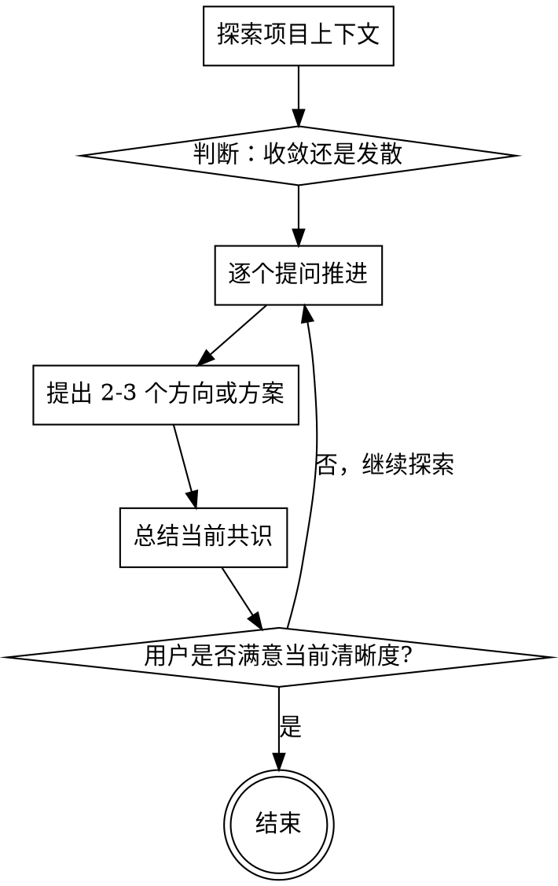

# 头脑风暴：需求探索与思路发散

通过自然的协作对话，帮助用户把模糊想法整理为更清晰的需求、边界和方向。

这个技能同时支持两种模式：

- **收敛模式**：澄清模糊需求，明确目标、约束、成功标准和范围
- **发散模式**：扩展思路，提出不同方向、切入点或方案，帮助用户比较与选择

先了解当前项目上下文，然后逐步提问、归纳、比较方案，并用纯文字帮助用户形成共识。

<HARD-GATE>
在完成需求探索或头脑风暴之前，不要调用任何实现技能、不要编写代码、不要搭建项目、不要采取任何实现行动。这适用于所有项目，无论看起来多简单。
</HARD-GATE>

## 反模式："这个太简单了，不需要先聊清楚"

每个项目都应该先经过这一步。一个小功能、一次行为修改、一个配置调整，甚至只是一个想法验证，都值得先明确问题和方向。真正简单的项目可以很快完成探索，但不能跳过。

## 核心流程

你必须按顺序完成以下事项：

1. **探索项目上下文** — 检查相关文件、文档、现有实现模式，必要时查看最近的 commit
2. **判断当前模式** — 识别当前更适合收敛需求，还是发散思路
3. **提出澄清或发散问题** — 每次一个，推动理解继续向前
4. **提出 2-3 种方向或方案** — 给出区别、权衡和推荐
5. **总结当前共识** — 用纯文字概括已明确的目标、边界或备选方向
6. **在用户确认后结束** — 当需求已清楚、方向已选定，或用户决定先停在这里时结束

## 流程图

**终止状态是对话结束。** 不要生成设计文档，不要 commit，不要调用 writing-plans 或任何其他后续技能。

## 流程详述

**理解当前问题：**

- 首先查看当前项目状态，理解已有结构、约束和相关背景
- 如果用户的问题实际包含多个独立主题，先帮助拆分，再决定当前先聚焦哪一部分
- 判断当前更适合：
  - **收敛**：用户目标模糊，需要澄清范围、约束、优先级
  - **发散**：用户目标大致明确，但需要更多想法、方向或备选方案
- 在整个过程中，每次只推进一个问题或一个决策点

**收敛模式：**

适用于需求不清楚、边界模糊、目标未定的情况。重点是帮助用户明确：

- 目标是什么
- 为什么要做
- 有哪些约束
- 什么算成功
- 什么不在当前范围内

**发散模式：**

适用于用户想扩展思路、寻找切入点或比较不同方向的情况。重点是帮助用户：

- 看见 2-3 个不同方向
- 理解每个方向的优缺点
- 判断哪个方向更适合当前上下文
- 避免在还没比较前就过早收敛

**提出方案：**

- 始终尽量给出 2-3 种方向、切入点或方案
- 先展示你推荐的方向，并解释为什么推荐它
- 推荐必须结合当前代码库和用户语境，而不是抽象偏好

**总结共识：**

- 定期用简洁文字总结当前已经明确的内容
- 总结可以包括：目标、边界、约束、成功标准、候选方案、推荐方向
- 如果用户发现总结不准确，立即回到提问阶段修正理解

**在现有代码库中工作：**

- 在给建议前先探索现有结构，遵循已有模式
- 如果现有实现确实影响当前讨论，可以指出与当前主题直接相关的问题
- 不要把对话带向与当前目标无关的重构或实现细节

## 严格限制

- **只进行文字交流** — 不提供浏览器渲染、不制作视觉原型、不引导用户打开本地 URL
- **不生成任何文档** — 不写设计文档、不写规格说明、不保存 brainstorming 产物到文件
- **不进入后续流程** — 需求或方向达成共识后直接结束，不自动进入实现、计划或其他技能

## 核心原则

- **每次一个问题** — 不要一次抛出多个问题
- **优先选择题** — 在可能的情况下比开放式问题更容易回答
- **收敛与发散都支持** — 根据当前需要灵活切换，而不是固定单一路径
- **探索替代方案** — 做决定前尽量给出 2-3 个方向
- **增量验证** — 持续总结当前理解，并让用户纠正偏差
- **保持灵活** — 一旦发现理解偏差，就回到澄清
- **严格遵循 YAGNI** — 不引入与当前探索目标无关的复杂度
